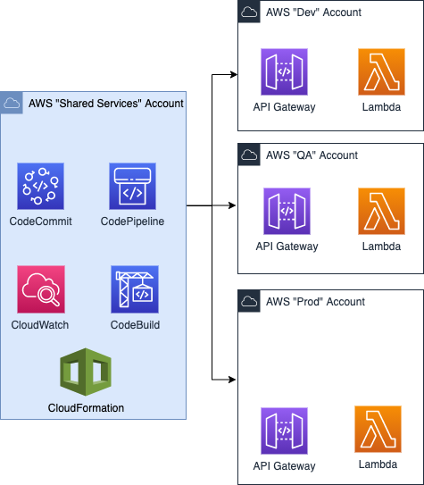

# Landing Zone CI/CD Requirements

## High Level Architecture

This repository contains Cloudformation scritps needed to be provisioned on AWS accounts to acheive a centralized CI/CD enterprise deployment model.  It provisions a CodeBuild project in the Centralized/Shared-Services account, along with CloudWatch event rule mapping to CodeCommit state changes.

This is based on a multi-account setup, where the Shared-Services account hosts CodeCommit and CodePipeline. The following diagram shows at a high level the account structure supported by these templates:

## Resources

This repository hosts Cloudformation templates needed to be provisioned to provide any necessary AWS resources across accounts to support CI/CD capabilities.  The diagram below higlights in "grey" boxes those resources that are provisioned as part of these templates

The box shown in "blue" highlights items that are not created by these templates and are provisioned per application deployment, given that a pipeline.yaml exists in your CodeCommit repository.  The CloudWatch event rule-mapping will detect the state change, and the Pipeline-Engine CodeBuild project will provision the resources that are part of your pipeline.

## How to use this

These Cloudformation scripts must be provisioned manually first, to allow for future CI/CD automation to occur.  

The "SharedAccount.yaml" Cloudformation stack must be provisioned on the "Shared Services" account as shown on the diagram.  The "TargetAccount.yaml" Cloudformation stack must be provisioned on the each of the deployment accounts, which can also be the same AWS account, if we wanted to mark Dev/Test to be the same account, as an example.

## CloudFormation Exports

There are Cloudformation Exports that are being referenced by CI/CD pipelines provisioned.  The folllowing table shows the exports and how they are consumed.  The table below shoes exports when using the following Cloudformation parameters:

ProjectPrefix: "dph"

| Export Name | Description |
| --- | --- |
| dph-pipeline-CICDBucketKeyAlias | Alias identifying KMS key used for S3 encrypt/decrypt of S3 buckets used within the pipeline.|
| dph-pipeline-CICDBucketKeyArn | ARN identifyig the KMS key for S3 encrypt/decrypt of S3 buckets used within the pipeline.|
| dph-pipeline-CICDBucketKeyId |Key Id identifyig the KMS key for S3 encrypt/decrypt of S3 buckets used within the pipeline|
| dph-pipeline-CodeStarServiceRole |If using CodeStar, this is the IAM role needed to provision toolchain resources as part of the CodeStar project.|
| dph-pipeline-CrossAccountSetupLambdaArn |This is an ARN that references a Custom Cloudformation resource/lambda used to provision target account with necessary AWS resources needed for CI/CD.|
| dph-pipeline-DeploymentBucket |This represents the deployment bucket used for Serverless applications|
| dph-pipeline-DeploymentBucketArn |This is the ARN value of the deployment bucket used to host the packaged serverless applications.|
| dph-pipeline-RemoteAccountRole |This is an IAM role to allow for initial provisioning of CI/CD resources on target accounts.|
| dph-pipeline-RemoteAccountRoleName |This is the name of the IAM role to allow for initial provisioning of CI/CD resources on target accounts.|

This repository is the foundation of the remainder of CI/CD pipeline deployments and must be proviionsed using Adminstrative role.  Provision these in the following order:

1. TargetAccount.yaml
2. SharedAccount.yaml

Once the accounts are setup, any CodeCommit repository containing a "pipeline.yaml" file will result in the provisioning of its resources, and the appropriate across-account IAM roles for the pipeline to perform the deployment.  A sample repository containing a sample application is provided in the link below.

https://github.com/aelmadho/aws-infra-blueprint

